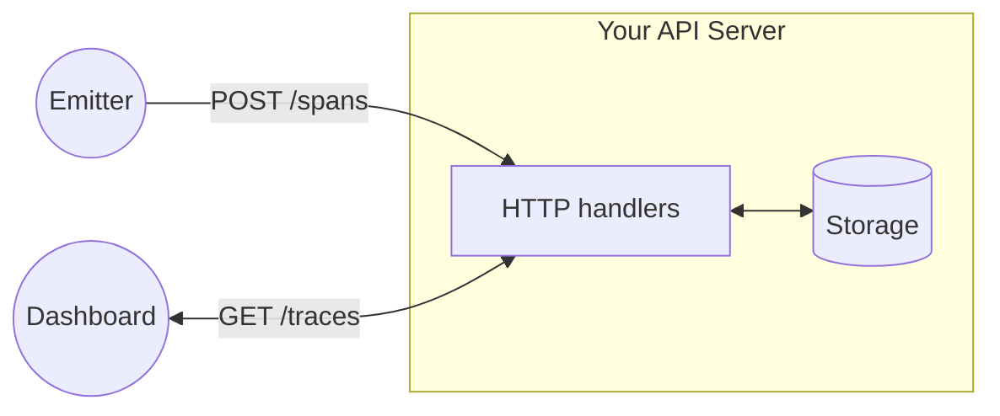

# Traced

Part of the [Backend Engineer Path](https://github.com/benx421/backend-engineer-path).

You will build a span ingestion server. A configurable number of concurrent workers will POST span batches at it continuously for a configurable duration. Some batches arrive out of order. Your server must assemble them into traces, apply a rolling time window, and serve accurate results to the dashboard. A verifier checks the results.

The storage layer is your design. Structuring it and keeping it correct under load is the core task.

## Prerequisites

| Requirement | Notes |
|---|---|
| Docker | [Install Docker](https://docs.docker.com/get-docker/) |
| Docker Compose | Included with Docker Desktop |
| Make | macOS/Linux only. Windows users run `docker compose` directly |

## What You'll Learn

- How to make storage correct under many simultaneous writers
- How to evict data on a rolling window without waiting for the next request
- How to store child spans that arrive before their parent and link them when the root appears
- How to ingest groups of spans in a single request
- How to implement an API from a contract with no existing implementation to reference

## Core Task

Imagine you work at an e-commerce company. Checkout is slow and nobody knows why. You open the tracing dashboard, find the offending request, and see the full picture: checkout called inventory, inventory called payment, payment timed out. Each hop is a span. Together they form a trace.

Someone had to build that collector. It receives spans from multiple services at once, assembles them into traces, and keeps a rolling window of recent data for the dashboard to query. That's what you're building here. Run `make up` and open [http://localhost:8081/docs](http://localhost:8081/docs) for the full API contract.

## System Architecture



## Implementation Requirements

### 1. Rolling window

The server reads a `WINDOW_MINUTES` environment variable (default `30`). Spans outside the window are discarded on ingest. Data that ages out must be evicted continuously in the background, not only when the next ingest request arrives.

### 2. Concurrent writes

The emitter runs multiple workers simultaneously. Your storage must handle concurrent reads and writes correctly.

### 3. Out-of-order spans

About 30% of batches have their spans shuffled so children arrive before the root. Your ingest path must accept and store them regardless.

### 4. Batched ingest

Spans arrive in batches. `POST /spans` receives the whole batch in one request body.

### 5. Trace status

A `TraceSummary` has `status: "error"` if *any* span in the trace has `status: "error"`, not just the root span.

## Running

```bash
cp .env.example .env
# Set TARGET_URL to your API, e.g. TARGET_URL=http://host.docker.internal:8080
```

`TARGET_URL=http://localhost:8080` will not work. The emitter runs inside Docker, so `localhost` resolves to the container, not your machine. Use `host.docker.internal` on macOS and Windows. On Linux, use your host's IP address (`ip route | awk '/default/ { print $3 }'`).

**With Make (macOS/Linux)**

| Command | What it does |
|---|---|
| `make up` | Serves the dashboard at [http://localhost:8081](http://localhost:8081) |
| `make emit` | Runs the emitter + verifier against your API |
| `make down` | Stops everything |

**Without Make (Windows)**

| Command | What it does |
|---|---|
| `docker compose up -d` | Serves the dashboard at [http://localhost:8081](http://localhost:8081) |
| `docker compose --profile tools run --rm emitter` | Runs the emitter + verifier against your API |
| `docker compose down` | Stops everything |

Start your server first, then start the dashboard, then run the emitter.

## The Emitter

The emitter generates synthetic traces and POSTs them to your API. Each trace has a root span and 1–4 child spans across a catalogue of services (`checkout`, `inventory`, `payment`, `shipping`, `notification`). About 5% of spans are marked `error`.

Configure via `.env` or CLI flags:

| Env var | Flag | Default | Description |
|---|---|---|---|
| `TARGET_URL` | `-target` | `http://localhost:8080` | Base URL of your API |
| `WORKERS` | `-workers` | `20` | Concurrent goroutines |
| `DURATION` | `-duration` | `60s` | How long the emitter runs |
| `WINDOW_MINUTES` | `-window` | `30` | Rolling window, must match your server |
| `OUT_OF_ORDER_PROB` | `-disorder` | `0.3` | Probability a batch is out of order |
| `BATCH_SIZE` | `-batch` | `10` | Max spans per request |
| `RATE_PER_WORKER` | `-rate` | `5` | Average requests/second per worker |
| `VERIFY` | `-verify` | `true` | Run the verifier after emission |

## The Verifier

When `VERIFY=true` (the default), the emitter runs a correctness check after emission. It compares the server-reported `total` from `GET /traces` against the number of traces sent within the window, then spot-checks span counts for a 10% sample.

A passing run:

```text
INFO verifier starting
INFO verification summary expected=13532 found=13532 missing=0 span_mismatches=0
INFO all checks passed
```

`make emit` always runs the verifier. Set `VERIFY=false` in your `.env` to skip it.

## The Dashboard

Open [http://localhost:8081](http://localhost:8081) after `make up`. Enter your API's base URL and click **Connect**. The dashboard polls every 3 seconds. Each trace shows up as a dot on a scatter plot. Hover for a summary, click to inspect the full span tree.

My frontend skills are rusty, so it's minimal. If you're comfortable with frontend work, replace it. Use React, add proper charting, build richer filtering, add new endpoints. The API contract is a starting point.

## Deliverables

### 1. Working server

An HTTP server that passes the verifier. Language, framework, and storage are your choice.

### 2. Tests

You don't need 100% coverage, but you need confidence that:

- Out-of-order span assembly produces correct traces
- Rolling window eviction removes the right data at the right time
- Concurrent writes don't corrupt state

### 3. TRADEOFFS.md

A document (max 1000 words) covering:

- **Storage design**: What did you choose and why?
- **Eviction**: How does rolling window eviction work in your implementation?
- **Concurrency**: How do you handle concurrent access? What's the trade-off?
- **What breaks first**: Under 10x the default load, what fails and why?
- **What you'd do differently**: With more time, what would change?

This matters more than perfect code. I want to see your thinking.

Write it yourself. An AI will give you a document that sounds right but says nothing: generic trade-offs, no actual numbers, no real decisions. If you can't explain in your own words why you made a choice, you haven't made it yet. Go back and figure out why.

## Resources

- [Google Dapper paper](https://research.google/pubs/pub36356/): The paper that defined traces, spans, and the parent/child model you're implementing. Read the first three sections.
- [OpenTelemetry: Observability Primer](https://opentelemetry.io/docs/concepts/observability-primer/): Explains where traces sit alongside metrics and logs, and why the data model is shaped the way it is.
- [Designing Data-Intensive Applications, Chapter 3](https://dataintensive.net/): Read it before you design your store.
- [Designing Data-Intensive Applications, Chapter 11](https://dataintensive.net/): Kleppmann on stream processing and windowing. The theory behind rolling windows.
- [An alternative approach to rate limiting](https://www.figma.com/blog/an-alternative-approach-to-rate-limiting/): The eviction problem here is the same one.
- Go: [Concurrency patterns](https://go.dev/blog/pipelines): relevant if you implement background eviction with goroutines.
- Go: [net/http](https://pkg.go.dev/net/http): the stdlib is sufficient. Read `ServeMux` and `Handler`.
- Python: [FastAPI](https://fastapi.tiangolo.com/) or [Flask](https://flask.palletsprojects.com/).
- Java: [Spring Boot REST](https://spring.io/guides/gs/rest-service).

## Submission

1. Create a Github repository
2. Create a PR from your feature branch to main/master
3. Include a proper PR description
4. Add `benx421` as a collaborator and request a PR review

I prioritise reviews for Go, Java, and Python implementations, but I'll review other languages as time permits.

Write the code yourself. AI is a reasonable tool for getting work done faster when you have a deadline. There is no deadline here. The entire point is to learn. The emitter and verifier in this repo took me three days to write and longer to design. I could have generated them in ten minutes. I didn't, because I wanted to understand what I was building. That's the only reason to do this at all.

The TRADEOFFS document especially should be your own thinking.
